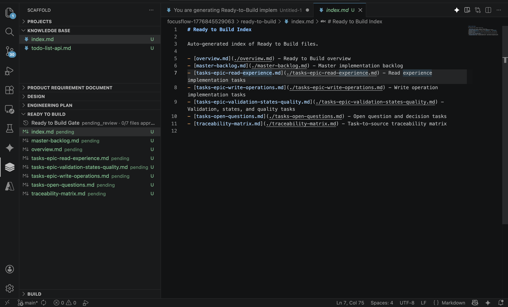

# Scaffold: Local-First Project Planning and Execution in VS Code

Scaffold is a VS Code extension for local-first software planning workflows. It helps individual developers organize project knowledge, map requirements clearly, and move from discovery to implementation with gated sections:

- Projects
- Knowledge Base
- Product Requirement Document (PRD)
- Design
- Engineering Plan
- Ready to Build
- Build

All content is stored as regular Markdown and JSON files inside your workspace, making it easy to version in Git and edit with any tool.

## Why Scaffold

- Local-first: your docs and workflow state stay in your repository.
- Structured planning: section-by-section workflow with approval gates.
- AI-friendly: map requirements and knowledge so AI coding assistants stay on track.
- GitHub-friendly: plain files, no proprietary data format.

## Works With Your AI Stack

Scaffold is model-agnostic. You can pair it with GitHub Copilot, Gemini, Claude, and other AI coding assistants.

- Flexible by design: choose your preferred assistant for each stage of planning and implementation.
- Customizable prompts: tune templates for onboarding, Ready-to-Build, and Build to match your workflow.
- Context that stays grounded: Scaffold keeps project requirements, decisions, and knowledge in your workspace so AI outputs stay aligned with real project context.
- Better continuity: move between tools without losing structure because your source of truth remains local files in your repository.

## Section Workflow

Scaffold organizes planning into sequential sections:

1. Knowledge Base
2. Product Requirement Document
3. Design
4. Engineering Plan
5. Ready to Build
6. Build

Each section can contain nested files and folders. Gate approvals help enforce readiness before progressing.

## Feature Walkthrough

1. **Create New Project**

Create a new project scaffold from the Projects view and start planning in a structured workflow.


2. **Create Knowledge Base**

Capture existing domain knowledge and architecture context before writing requirements.


3. **Define Product Requirements**

Write Product Requirement Document files that become the source of truth for implementation.


4. **Define UI Specifications**

Document UI behavior and constraints to reduce ambiguity before engineering starts.


5. **Add Engineering Plan (Step 1)**

Break requirements into actionable technical plans and implementation units.


6. **Add Engineering Plan (Step 2)**

Expand the plan with detailed tasks, ownership, and sequencing.


7. **Generate Ready-to-Build Task Planning Prompt**

Create an AI-ready prompt from approved sections to produce execution-ready tasks.


8. **Review Generated Ready-to-Build Tasks**

Inspect the generated task list before moving into implementation.



9. **Generate Build Coding Prompt**

Produce a coding prompt aligned with your approved plan so implementation stays on-track.


## Data Layout

By default, Scaffold stores data under:

- `.scaffold/projects/<project-id>/`

Inside each project:

- `.meta.json` for project metadata
- `sections.json` for section gate states
- `knowledge-base/` for structured Markdown docs
- `prd/` for Product Requirement Document files
- `design/` for Design docs
- `engineering-plan/` for implementation planning docs
- `ready-to-build/` for execution-ready tasks
- `build/` for implementation artifacts
- `.approvals/` for approval metadata
- `activity.jsonl` for append-only activity tracking

## Commands

Key commands exposed by Scaffold:

- Scaffold: Initialize Workspace
- Scaffold: New Project
- Scaffold: Onboard Existing Project
- Scaffold: Set Active Project
- Scaffold: Delete Project
- Scaffold: Approve Section
- Scaffold: Approve File
- Scaffold: Generate Ready-to-Build Prompt
- Scaffold: Generate Build Coding Prompt
- Scaffold: Open Build Folder Externally
- Scaffold: Rename
- Scaffold: Delete
- Scaffold: Refresh

## Settings

- `scaffold.gateMode`: `strict` or `flexible`
- `scaffold.dataFolder`: data root folder name (default `.scaffold`)
- `scaffold.readyToBuildPromptTemplate`: template for ready-to-build prompt generation
- `scaffold.readyToBuildPromptOutput`: output target (`editor`, `clipboard`, `both`)
- `scaffold.buildPromptTemplate`: template for build prompt generation
- `scaffold.buildPromptOutput`: output target (`editor`, `clipboard`, `both`)
- `scaffold.onboardPromptTemplate`: template for onboarding prompts
- `scaffold.onboardPromptOutput`: output target (`editor`, `clipboard`, `both`)

## Local Development

1. Install dependencies:

```bash
npm install
```

2. Compile:

```bash
npm run compile
```

3. Launch Extension Development Host:

- Press `F5` in VS Code

## License

MIT
