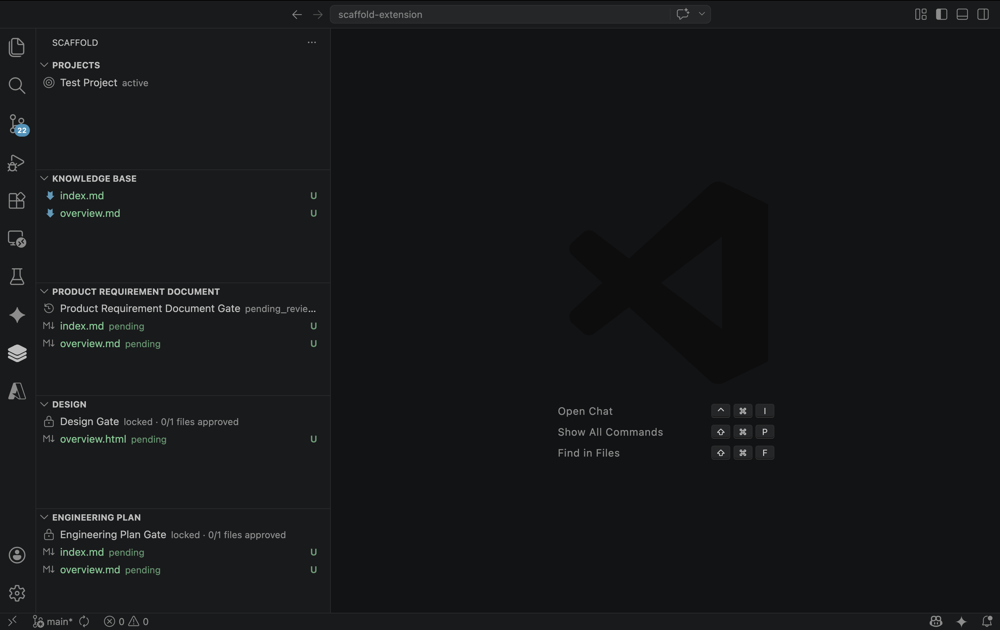
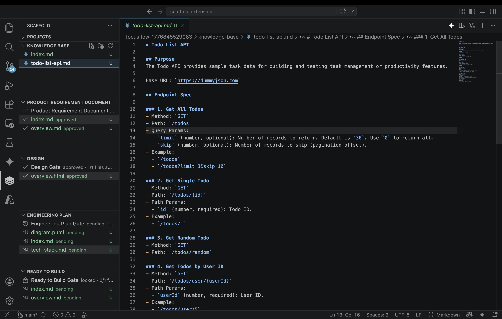
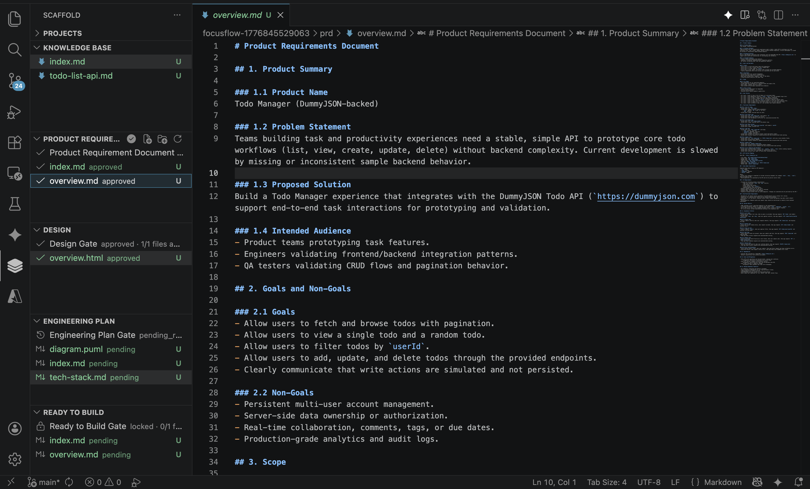
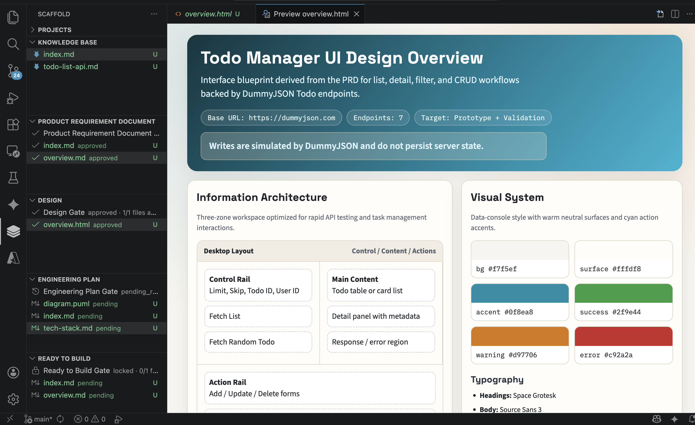
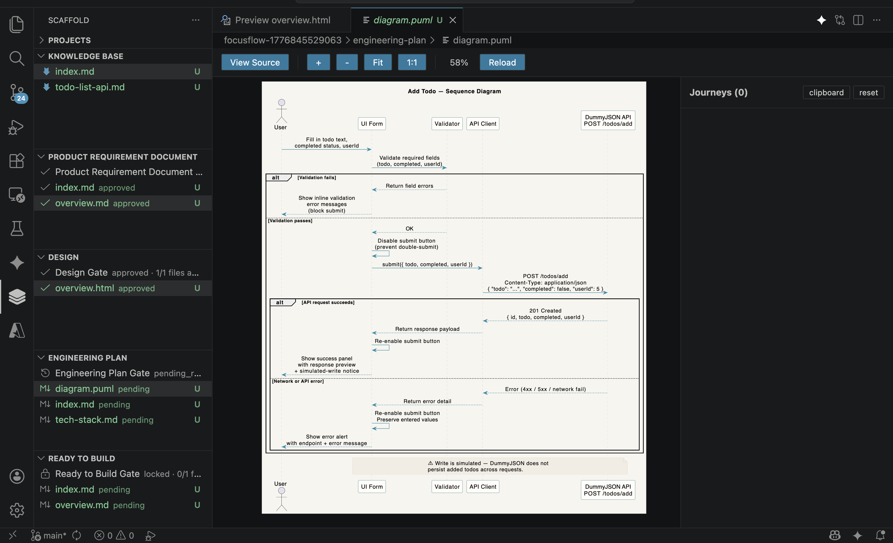
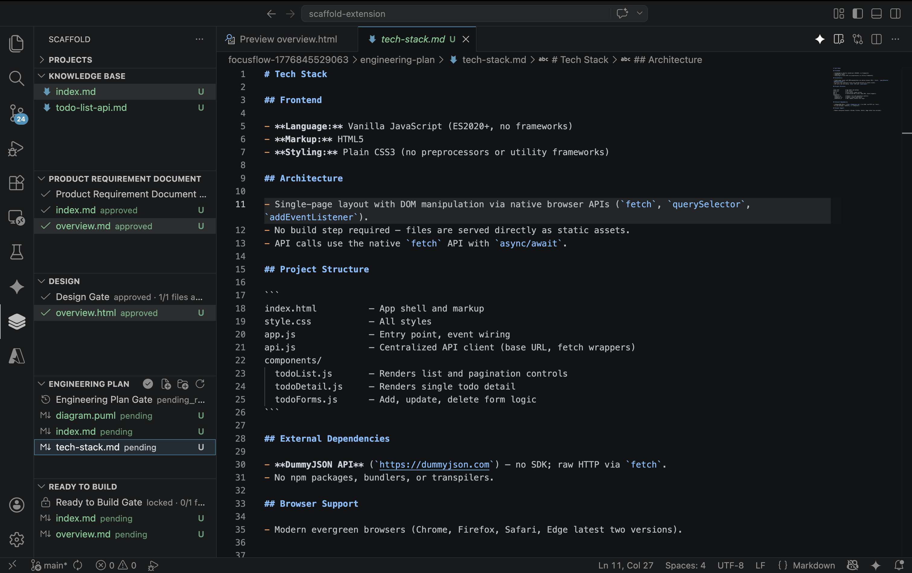
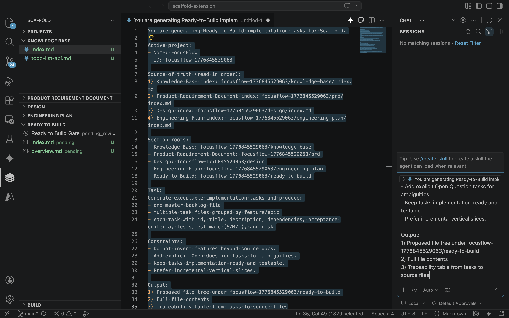
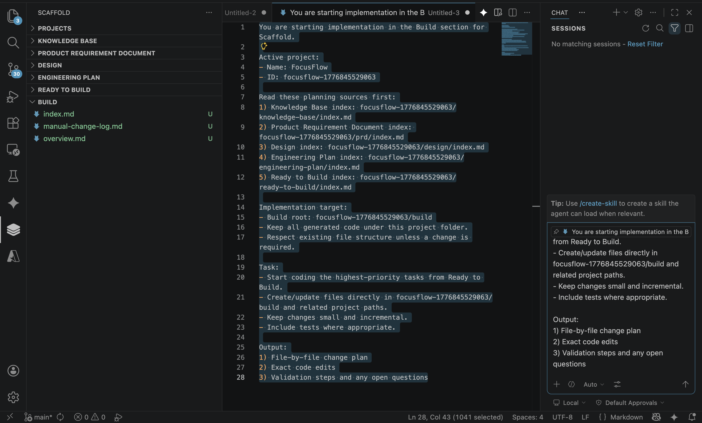

# Scaffold: Local-First Project Planning and Execution in VS Code

Scaffold is a VS Code extension for local-first software planning workflows. It helps individual developers organize workspace knowledge, map requirements clearly, and move from discovery to implementation with a state machine workflow:

- **Knowledge Base** - capture domain context and constraints
- **Product Requirement Document (PRD)** - define features and user stories
- **UI Design** - specify interactions and visual hierarchy
- **Engineering Plan** - detail technical architecture and approach
- **Task Plan** - break work into executable tasks and track progress

All content is stored as regular Markdown and JSON files inside your workspace, making it easy to version in Git and edit with any tool.

## Why Scaffold

- **Local-first**: your docs and workflow state stay in your repository—no cloud dependencies.
- **Structured planning**: sequential 5-section workflow with file-level state tracking (editing → finalized).
- **AI-guided**: detailed, context-aware prompts for task planning and code generation that keep AI assistants aligned with your full planning context.
- **Git-friendly**: plain Markdown and JSON files, version control ready.
- **Incremental refinement**: finalize files as they're ready, create revisions (_v2, _v3) to iterate without losing history.

## Works With Your AI Stack

Scaffold is model-agnostic. You can pair it with GitHub Copilot, Gemini, Claude, and other AI coding assistants.

- Flexible by design: choose your preferred assistant for each stage of planning and implementation.
- Customizable prompts: tune templates for Task Plan and Code generation to match your workflow.
- Context that stays grounded: Scaffold keeps project requirements, decisions, and knowledge in your workspace so AI outputs stay aligned with real project context.
- Better continuity: move between tools without losing structure because your source of truth remains local files in your repository.

## Section Workflow

Scaffold organizes planning into 5 sequential sections:

1. **Knowledge Base** - capture existing context and constraints
2. **Product Requirement Document** - define features and success criteria
3. **UI Design** - specify user interactions and design decisions
4. **Engineering Plan** - detail implementation approach and architecture
5. **Task Plan** - generate executable tasks and track progress

Each section unlocks when the previous section has at least one finalized file. Within sections, files can be:
- **Editing** - in progress, editable
- **Finalized** - read-only, versioned with auto-increment (_v2, _v3) for iterations

Finalized files generate the context for AI prompts, ensuring consistent alignment with your planning decisions.

## Feature Walkthrough

1. **Initialize Workspace**

Initialize Scaffold in your workspace and start planning in a structured workflow.



2. **Create Knowledge Base**

Capture existing domain knowledge and architecture context before writing requirements.



3. **Define Product Requirements**

Write Product Requirement Document files that become the source of truth for implementation.



4. **Define UI Specifications**

Document UI behavior and constraints to reduce ambiguity before engineering starts.



5. **Add Engineering Plan (Step 1)**

Detail your technical architecture and implementation approach based on requirements and design.



6. **Finalize Planning Documents**

Mark planning files as finalized when ready. This:
- Makes files read-only (prevents accidental edits)
- Unlocks the next section
- Generates index.md for AI context

To iterate on finalized files, use "Create Revision" to auto-generate _v2, _v3 versions.



7. **Generate Task Plan Prompt**

Click "Generate Task Plan Prompt" in the Task Plan section toolbar to create an AI-ready prompt. This prompt includes:
- Full context from all previous planning documents (Knowledge Base → Engineering Plan)
- Instructions for breaking work into executable tasks
- Expected output format (master backlog + detailed task files)

Prompt appears in editor/clipboard for use with any AI assistant.



8. **Review and Refine Tasks**

Review AI-generated tasks, refine them directly in Task Plan section, and finalize when ready.

9. **Generate Code Prompt**

Click "Generate Code Prompt" in the Task Plan section toolbar to create a detailed implementation guide. This includes:
- All planning context for reference
- Current task backlog and priorities
- Step-by-step implementation workflow
- Design/architecture compliance requirements

Use this prompt to guide AI coding assistants in building features.



10. **Track Progress**

As tasks are completed:
- Mark tasks as done using "Mark Task Done" action
- Create revisions of task files as needed
- All progress tracked in backlog.md automatically


## Data Layout

By default, Scaffold stores data under:

- `.scaffold/`

Inside `.scaffold/`:

- `sections/knowledge-base/` - Knowledge Base docs
- `sections/prd/` - Product Requirement Document files
- `sections/design/` - UI Design docs  
- `sections/engineering-plan/` - Implementation planning docs
- `sections/ready-to-code/` - Task Plan files and backlog
- `.states/` - file status tracking (editing/finalized) per section
- `*.md` - generated index files per section (auto-updated on file changes)

**Implementation code** lives in your workspace root (outside `.scaffold/`) so all code and dependencies stay in your project source tree and version control.

Each section auto-generates an `index.md` file listing all files and their current status—useful for AI context in prompts.

## Commands

Key commands exposed by Scaffold:

- Scaffold: Initialize Workspace
- Scaffold: Finalize File (makes file read-only)
- Scaffold: Create Revision (creates _v2, _v3, etc. copies)
- Scaffold: Mark Task Done (checks off task in backlog)
- Scaffold: Generate Task Plan Prompt (generates detailed prompt to create tasks)
- Scaffold: Generate Code Prompt (generates detailed prompt to implement code)
- Scaffold: Rename
- Scaffold: Delete
- Scaffold: Refresh

## Settings

- `scaffold.dataFolder`: data root folder name (default `.scaffold`)
- `scaffold.readyToBuildPromptTemplate`: template for task plan prompt generation
- `scaffold.readyToBuildPromptOutput`: output target (`editor`, `clipboard`, `both`)
- `scaffold.codePromptTemplate`: template for code implementation prompt generation
- `scaffold.codePromptOutput`: output target (`editor`, `clipboard`, `both`)

## Local Development

1. Install dependencies:

```bash
npm install
```

2. Compile:

```bash
npm run compile
```

3. Launch Extension Development Host:

- Press `F5` in VS Code

## License

MIT
